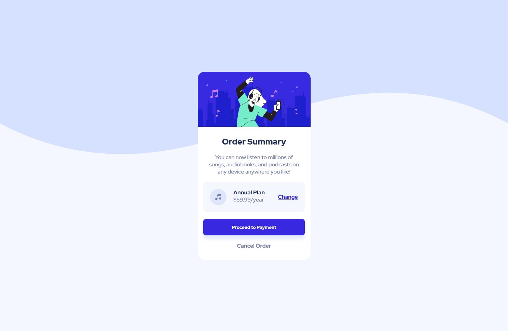

# Frontend Mentor - Order summary card solution

This is a solution to the [Order summary card challenge on Frontend Mentor](https://www.frontendmentor.io/challenges/order-summary-component-QlPmajDUj). Frontend Mentor challenges help you improve your coding skills by building realistic projects. 

## Table of contents

- [Overview](#overview)
  - [Screenshot](#screenshot)
  - [Links](#links)
- [Author](#author)

## Overview

### Screenshot

### Links

- Solution URL: [https://github.com/TomasAyerbe/order-summary-component](https://github.com/TomasAyerbe/order-summary-component)
- Live Site URL: [https://tomasayerbe.github.io/order-summary-component](https://tomasayerbe.github.io/order-summary-component)

## Author

- Website - [https://github.com/TomasAyerbe](https://github.com/TomasAyerbe)
- Frontend Mentor - [@TomasAyerbe](https://www.frontendmentor.io/profile/TomasAyerbe)